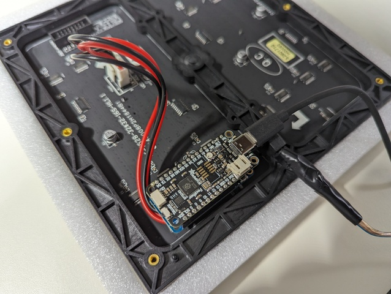
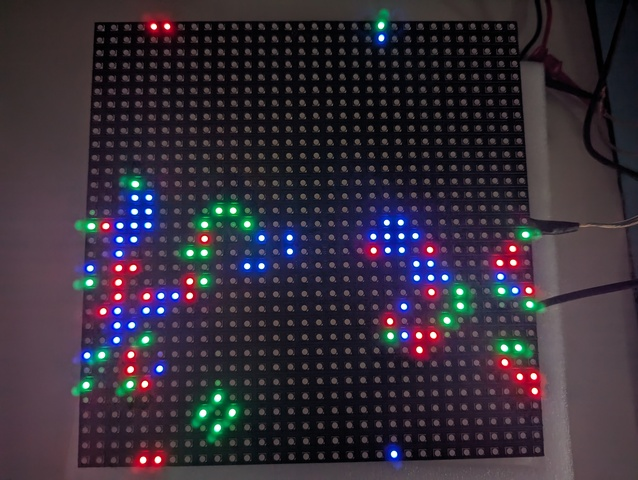

# embassy-adafruit-rpi-2040-uf2-led-matrix

Latest code is written by **Gemini CLI**

[Embassy](https://github.com/embassy-rs/embassy) project driving a [32x32 LED Matrix](https://www.adafruit.com/product/607) with an RP2040 (e.g., [Adafruit Feather RP2040](https://learn.adafruit.com/adafruit-feather-rp2040-pico/overview)).

## Examples

Run any of the following simulations using `cargo run --release --bin <name>`:

- `cca`: Cyclic Cellular Automata (mesmerizing colorful spirals).
- `lorenz`: Lorenz Attractor (chaotic butterfly orbits with fading trails).
- `ants`: Multi-species Langton's Ant simulation.
- `gol`: Classic Conway's Game of Life.
- `blink`: Simple dual-LED blinker (Core 0 only).
- `matrix_test_pins`: Hardware verification for matrix wiring.

## Flashing & Development

### Prerequisite: elf2uf2-rs
Ensure you have the latest version of `elf2uf2-rs` (version 0.1.15+ recommended to avoid ABI errors):
```bash
cargo install elf2uf2-rs --force
```

### Deploying
1. Connect your board while holding **BOOTSEL**.
2. Run your chosen binary:
   ```bash
   cargo run --release --bin lorenz
   ```

### Logging
Logs are sent via **RTT**. Use `probe-rs run --chip RP2040` if you have a debug probe connected.

## Hardware Setup


